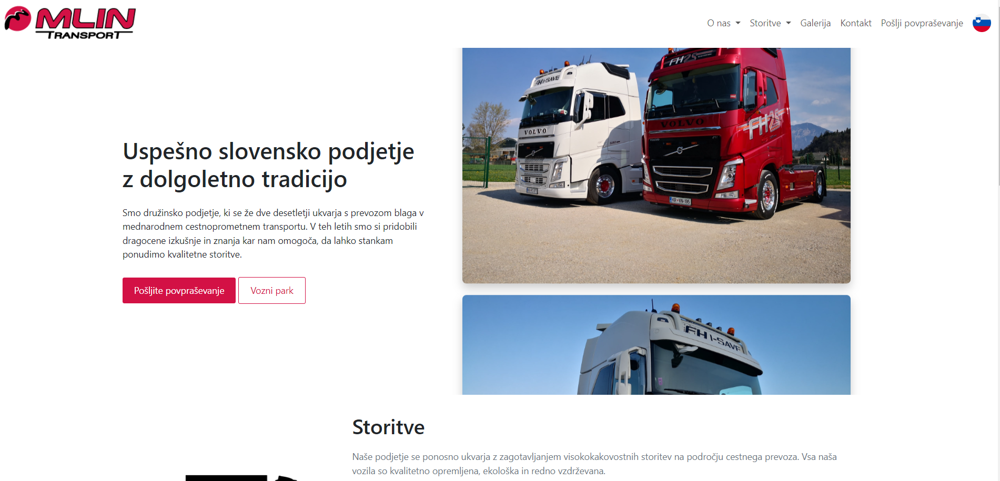
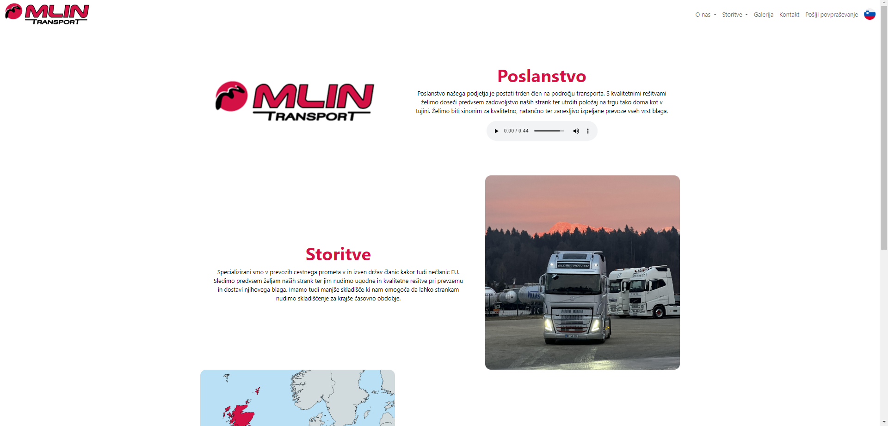
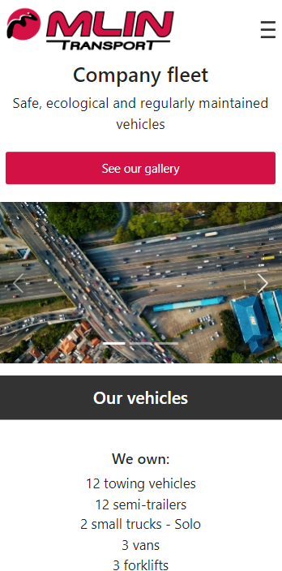
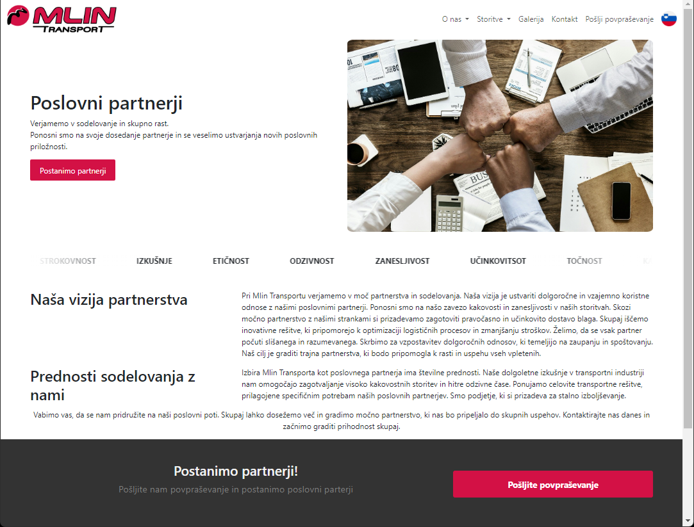
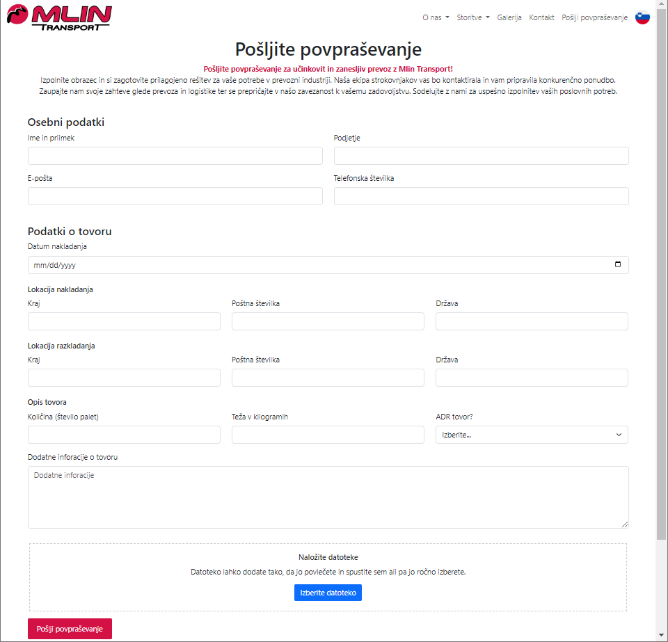
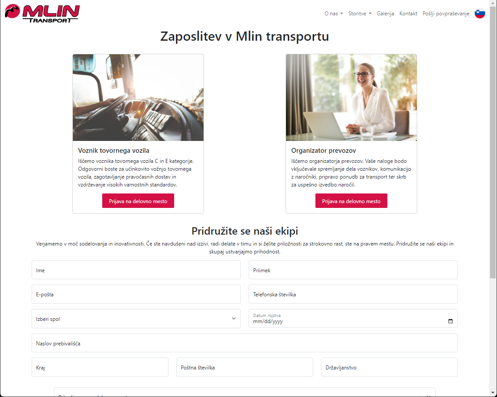
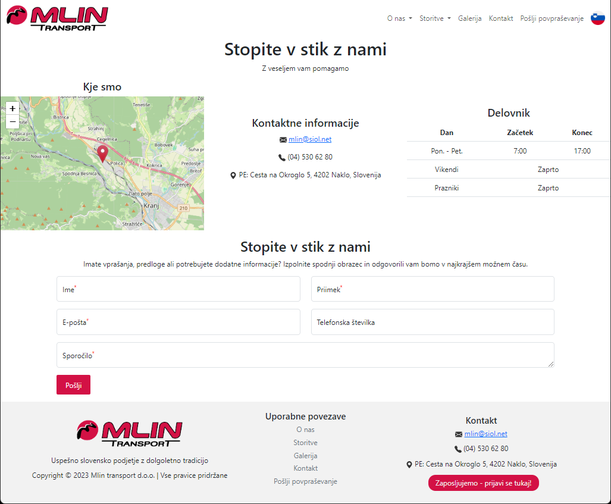

# Mlin Transport website

A modern, responsive website built for a local logistics company Mlin Transport.
The site is fully mobile-friendly and optimized for all screen sizes.

Demo: https://dvojnil.github.io/

## Tech stack
- HTML
- CSS
- JS
- [Bootstrap](https://getbootstrap.com/)
- [FormSubmit](https://formsubmit.co)

## Gallery

  

  

  

  

  

  

  

